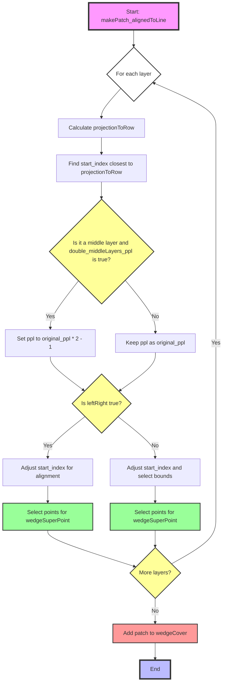

# Algorithm Insights

## MakePatchAlignedToLine

```mermaid
flowchart TB
    A[Start: makePatch_alignedToLine] --> B{For each layer}
    B --> C[Calculate projectionToRow]
    C --> D[Find start_index closest to projectionToRow]
    D --> E{Is it a middle layer and double_middleLayers_ppl is true?}
    E -->|Yes| F[Set ppl to original_ppl * 2 - 1]
    E -->|No| G[Keep ppl as original_ppl]
    F --> H{Is leftRight true?}
    G --> H
    H -->|Yes| I[Adjust start_index for alignment]
    I --> J[Select points for wedgeSuperPoint]
    H -->|No| K[Adjust start_index and select bounds]
    K --> L[Select points for wedgeSuperPoint]
    J --> M{More layers?}
    L --> M
    M -->|Yes| B
    M -->|No| N[Add patch to wedgeCover]
    N --> O[End]
    
    style A fill:#f9f,stroke:#333,stroke-width:4px
    style O fill:#bbf,stroke:#333,stroke-width:4px
    style B fill:#fff,stroke:#333,stroke-width:2px
    style E fill:#ff9,stroke:#333,stroke-width:2px
    style H fill:#ff9,stroke:#333,stroke-width:2px
    style M fill:#ff9,stroke:#333,stroke-width:2px
    style J fill:#9f9,stroke:#333,stroke-width:2px
    style L fill:#9f9,stroke:#333,stroke-width:2px
    style N fill:#f99,stroke:#333,stroke-width:2px
```

